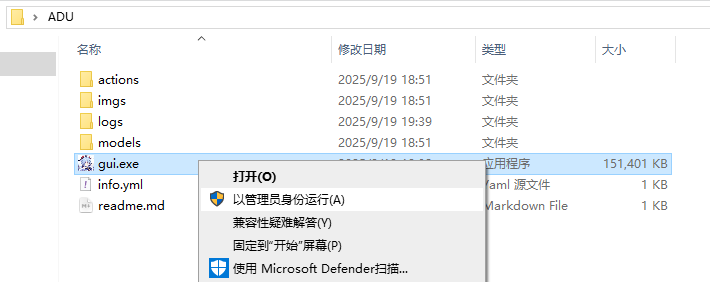

### APP运行

**1.以管理员身份运行gui.exe**



**2.UI界面出现后别着急运行脚本**


**3.先打开游戏,将游戏分辨率设置为1920*1080窗口模式,并传送到差分宇宙**


**4.保持以上界面,点击开始脚本,开始运行**

**5.如果想要退出请使用win+Tab快捷键组合,将当前主窗口切到ui界面,此时脚本阻塞,可获得键鼠控制权,点击停止按钮即可。**

### 源代码运行

**第一次运行**

建议使用miniconda3，创建虚拟环境并安装依赖库（conda需要在cmd下运行，powershell可能无法切换虚拟环境）

```plaintext
conda create -n asu python=3.12 -y
conda activate asu
pip install -r requirements.txt
```

或者直接安装（不建议）：双击`install_requirements.bat`安装依赖库

重命名info_example.yml为info.yml

**运行自动化**

命令行运行

差分宇宙
```plaintext
python diver.py
```

详细参数：
```plaintext
python diver.py <--debug> <--speed> <--cpu> --nums=<nums>
```
--speed：开启速通模式

--debug：开启调试模式

--cpu：图像识别强制使用cpu

nums：指定通关次数，必须为正整数

```plaintext
python diver.py --bonus=<bonus> --debug=<debug> --speed=<speed> --find=<find> --nums=<nums>
```
bonus in [0,1]：是否开启沉浸奖励

speed in [0,1]：开启速通模式

consumable in [0,1]：精英和首领战之前是否使用最左上角的消耗品

debug in [0,1,2]：开启调试模式

find in [0,1]：0为录图，1为跑图

nums：指定通关次数，必须为正整数

----------------------------------------------------------------------------------------------

`info.yml`内容如下
```yaml
config:
  # 难度，1-5，（5代表最高难度，如果世界没有难度5则会选择难度4）
  difficulty: 5
  # 队伍类型 目前只支持：追击/dot/终结技/击破/盾反
  team: 终结技
  # 速通模式
  speed_mode: 0
  # 图像识别强制使用cpu
  cpu_mode: 0
  # 首领房间需要开秘技的角色，按顺序开
  skill:
    - 黄泉
  # 自动存档数量，0-4，0代表不存档，1-4代表自动存档到前1-4个存档位
  save: 4
  timezone: Default
  max_run: 34
```

必须携带至少一名远程平a角色，最好放在1号位

注意！！！！！ 开始运行/开始校准之后就不要移动游戏窗口了！要移动请先停止自动化！

**校准**

如果出现视角转动过大/过小而导致迷路的问题，可能是校准值出问题了，可以尝试手动校准：

进入游戏，将人物传送到黑塔的办公室，然后命令行运行 `python align_angle.py`，等待视角转换/原地转圈结束

改变鼠标dpi可能会影响校准值，此时需要重新校准。

## 注意事项

**第一次运行**

在游戏中设置“自动沿用战斗设置”

**运行自动化**

点击运行

注意！！！！！ 开始运行/开始校准之后就不要移动游戏窗口了！要移动请先停止自动化！

**TIPS：**

尽量使用远程角色作为一号位，队伍中必须至少有一名远程角色。

F8/‘停止’按钮停止运行。

显隐表示显示/隐藏命令行窗口，默认隐藏

调试模式：如果不希望迷路后退出结算，请开启调试模式

速通模式：开启表示追求最高效率通关，低配队伍慎用


**校准**

如果出现视角转动过大/过小而导致迷路的问题，可能是校准值出问题了，可以尝试手动校准：

进入游戏，将人物传送到黑塔的办公室，然后点击校准，等待视角转换/原地转圈结束

改变鼠标dpi可能会影响校准值，此时需要重新校准。


### **特别声明**

本脚本来自Github开源项目**自动化模拟宇宙**(Auto_Simulated_Universe:https://github.com/CHNZYX/Auto_Simulated_Universe),由**Waverider02**改写(https://github.com/Waverider02/ADU),仅供交流学习,禁止商用。
